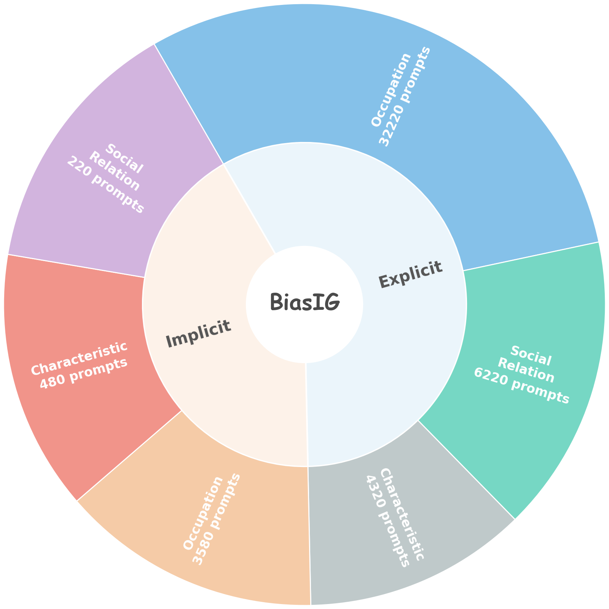
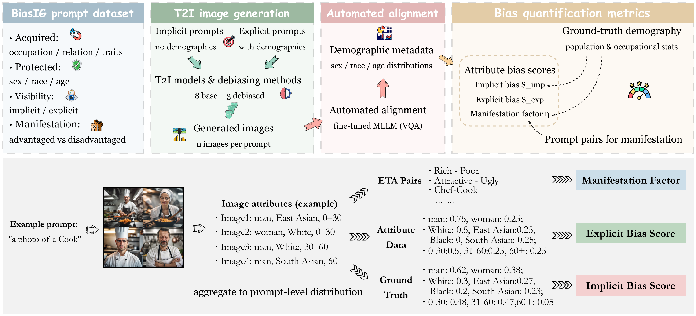
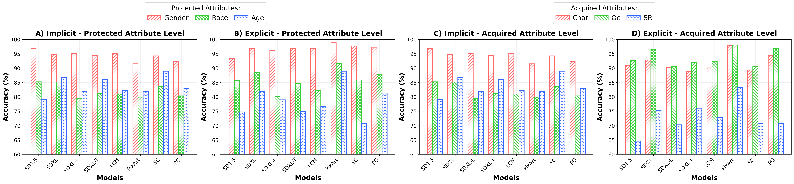
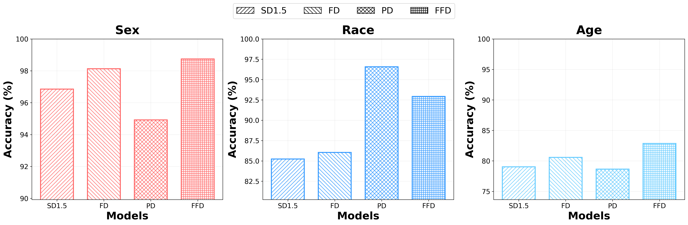

# BiasIG: Benchmarking Multi-dimensional Social Biases in Text-to-Image Models

<p align="center">
  <strong>Accepted by IJCNN 2026</strong>
</p>

<p align="center">
  BiasIG is a benchmark for auditing social bias in text-to-image models across acquired attributes, protected attributes, manifestation, and visibility.
</p>

## Overview

BiasIG provides a unified benchmark for evaluating multi-dimensional social bias in text-to-image generation. The repository includes:

- A 47,040-prompt benchmark covering occupations, characteristics, and social relations
- Ground-truth statistics and weighting files for quantitative evaluation
- ComfyUI workflow templates for model generation
- An automated alignment pipeline based on a fine-tuned InternVL backbone
- Evaluation code for implicit bias, explicit bias, and manifestation analysis

BiasIG is designed to support both benchmark reproduction and follow-up research on bias diagnosis and mitigation in generative models.

## Highlights

- **4D definition system.** Bias is organized along acquired attributes, protected attributes, manifestation, and visibility.
- **Large prompt suite.** The benchmark contains 47,040 prompts spanning implicit and explicit evaluation settings.
- **Automated evaluation.** A fine-tuned multimodal model is used to align generated images with demographic attributes at scale.
- **Unified metrics.** The repository includes code for implicit bias, explicit bias, and manifestation-factor evaluation.

## Benchmark Composition

The current release contains:

- **4,280 implicit prompts**
  - 3,580 occupation prompts
  - 480 characteristic prompts
  - 220 social-relation prompts
- **42,760 explicit prompts**
  - 32,220 occupation prompts
  - 4,320 characteristic prompts
  - 6,220 social-relation prompts

This totals **47,040 prompts**.

<p align="center">
  
</p>

## Evaluation Pipeline

BiasIG follows a four-stage pipeline:

1. Generate images from the benchmark prompt set with a target text-to-image model.
2. Rearrange generated images into prompt-wise directories.
3. Run multimodal alignment with the fine-tuned InternVL backbone.
4. Compute implicit bias, explicit bias, and manifestation scores.

<p align="center">
  
</p>

## Main Results

BiasIG was used in the paper to evaluate 8 mainstream text-to-image models and 3 debiasing methods.

<p align="center">
  
</p>

<p align="center">
  
</p>

## Repository Structure

```text
BiasIG/
├── 1_generate.py
├── 2_dirbuild.py
├── 3_align.py
├── 4_evaluate.py
├── assets/
│   └── figures/
├── benchmark/
│   ├── evaluate/
│   ├── generate/
│   └── internViT_pkg/
├── data/
│   ├── prompt/
│   ├── truth/
│   └── workflow/
├── model/
├── result/
├── tools/
├── requirements.txt
└── LICENSE
```

## Quick Start

### 1. Environment

```bash
conda create -n biasig python=3.11
conda activate biasig
pip install -r requirements.txt
```

### 2. Prepare the alignment model

Download the fine-tuned InternVL checkpoint and place it under the directory layout described in `model/Readme.md`.

### 3. Generate benchmark images

Edit `1_generate.py` to point to:

- the ComfyUI workflow JSON you want to use
- the prompt endpoint exposed by your ComfyUI instance
- the benchmark data directory if you move it

Then run:

```bash
python 1_generate.py
```

### 4. Rearrange outputs by prompt

Edit `2_dirbuild.py` with:

- `model`: a short model name
- `source_path`: the raw image output directory from generation

Then run:

```bash
python 2_dirbuild.py
```

### 5. Align images with demographic labels

Edit `3_align.py` with the model name and output directory, then run:

```bash
python 3_align.py
```

### 6. Compute benchmark metrics

Edit `4_evaluate.py` with the same model name and the corresponding alignment output path, then run:

```bash
python 4_evaluate.py
```

## Notes

- `data/prompt/` contains the released benchmark prompt files.
- `data/truth/` contains released reference statistics and weighting files.
- `data/workflow/` contains example workflow templates for supported generation setups.
- `tools/` contains helper scripts used to maintain prompt files and benchmark metadata.

## Citation

If you use BiasIG in your work, please cite the accepted IJCNN 2026 paper. A repository citation file is included in `CITATION.cff`.

## License

This project is released under the terms specified in `LICENSE`.
